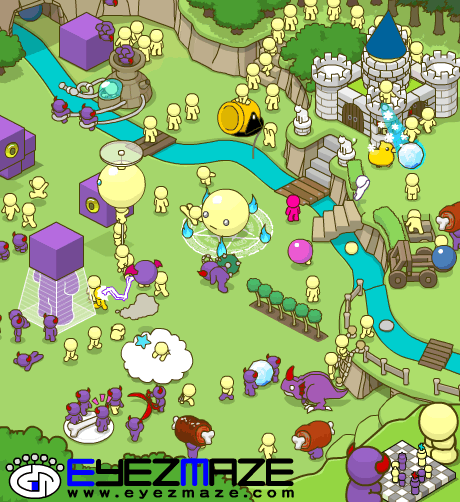

## Graphs, The Fabric of DevOps
<span style="color:gray">Rob Schoening:  @rschoening</span><br>
<span style="color:gray">Ashley Sun:  @ashleycsun</span>

Note:
Notes will show up in the speaker view, only available in offline mode

---

###Lending Club 
- we run LC's infrastructure
- with graphs! <!--.element: class="fragment" -->
- step |
- through | 
- points |

---

###Code Example
```java
public void createGitHubClient(String githubToken, String githubUrl) { 
                if (Strings.isNullOrEmpty(githubToken)) {
                        return;
                }
                
                try {
                        GitHubBuilder builder = new GitHubBuilder()
                                        .withConnector(new OkHttpConnector(new OkUrlFactory(new OkHttpClient())))
                                        .withEndpoint(githubUrl)
                                        .withOAuthToken(githubToken);
                        
                        github = builder.build();
                        
                } catch (IOException | RuntimeException e) { 
                        throw new FluxException("problem creating GitHub client", e);
                }
        }
```

--- 

###Vertical Slide Example 
click the down button/arrow

+++ 

#### Microservices 


+++

#### AWS
yay cloud<br>


---

### Look we are open source
Check out <a target="_blank" href="https://github.com/LendingClub/mercator">Mercator</a>!

---

##The End


